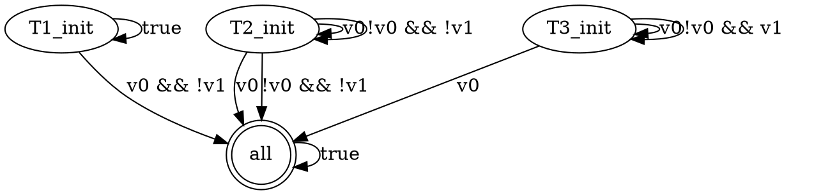

unite - Uvw learNer from posITive Examples
============================================
The _unite_ tool computes n-tight universal very weak omega-word automata (UVW) from lists of lasso-shaped positive examples.

It implements the learning approach presented in the paper _Learning Properties in LTL ∩ ACTL from Positive Examples Only_ by [Rüdiger Ehlers](https://www.ruediger-ehlers.de), [Ivan Gavran](https://people.mpi-sws.org/~gavran/), and [Daniel Neider](https://people.mpi-sws.org/~neider/), presented at the [Twentieth International Conference on Formal Methods in Computer-Aided Design](https://fmcad.forsyte.at/FMCAD20/) (FMCAD 2020).

This paper can be obtained from the academic homepages of any of the authors, linked above.

The _unite_ tool consists of two parts:

* A _simple chain_ enumerator, written in C++
* A tool for merging the simple chains found by the former tool and reducing the size of the resulting UVW, written in Python


Installation
============

Requirements
------------
- A moderately modern C++ and C compiler installed in a Unix-like environment. Linux and MacOS should be fine.
- An installation of Python 3 with the `dd` library installed. Under Linux, it can be installed with the `pip3 install dd` command.

Builing the simple chain enumerator
------------------------------------
In order to build the enumerator, open the terminal and run:

> cd src/ParetoBasedEnumerator; ./quick_build.sh; cd ../..


Input format
=================================================
The input to the tool is a file with positive examples. Each positive example is lasso-shaped, and the lassos consist of a lasso handle and a lasso cycle. Both the handle and the cycle are finite strings. Each character in the string assigns values of 0 or 1 to a fixed set of atomic propositions.

The input text files have the following format:

1. The first line has the text `Learning problem with character width: X`, where `X` is the number of atomic propositions.
2. The second line has the text `Nof characters: Y`, where `Y` is the number of assignments to the propositions that are actually used. This is typically two to the power of `X`. If other (smaller) values are used, then only the lexicographically smallest assignments to the `X` atomic propositions may be used in the positive examples. Characters that are not allowed are ignored during automaton learning.
3. All other lines contain positive examples. Each line consists of two strings of `0`s and `1`s, separated by a space. The first string represents the lasso handle, while the second string represents the lasso cycle. The length of each string is a multiple of `X`. The lasso handle can also be empty. The strings contain the binary encodings of the characters in the lasso handle and the lasso cycle, without separators between the encoded characters.

As an example, an input file of the form
```
Learning problem with character width: 2
Nof characters: 4
01 0011
 11
```
encodes two positive examples over a learning problem with 2 atomic propositions. The first positive example has the character assigning 0 to the first proposition and 1 to the second proposition repeated once as lasso handle. The lasso cycle consists of the character 00 and 11, where in the first character, both atomic propositions have 0 values, and the in the second character, both propositions have 1 values. The second positive examples has a handle of length 0, and the lasso cycle example consists only of the character 11.


Output format
=================================================
The first tool outputs a set of strongest simple chains. The second tool takes it as input and builds a UVW. The output of the second tool is an automaton description ready to be drawn by the tool ``dot`` of the graphviz package. For instance, For the positive example list from above, the output would be:



All initial states carry "init" in their names. Rejecting states are doubly-circed.


Examples provided with the tool
=================================================
The tool comes with the benchmark input files used in the paper accompanying the tool in the folder `examples`. The file names encode:

1. The property number (counting from 0 instead of from 1 as done in the paper)
2. The number of characters in the benchmark
3. The chain length for which the benchmark was used 
4. The experiment number - Each experiment in the paper was repeated 10 times with different positive example sets.

All text files have been GZipped to reduce memory consumption on disk. They can be decompressed on-the-fly when running the tool chain.


Running the tool chain
======================

The Components
--------------

The ``src/ParetoBasedEnumerator/solver`` tool computes simple chains from positive examples. It has the following parameters:

* An input file name - can be `/dev/stdin` to read from the standard input
* A maximal chain length, provided as a number after the `-c` command line parameter. It defaults to 2.
* A number of positive examples to look at, provided as a number after the `-l` command line parameter. By default, all input lines are used.

The tool prints a chain list to `stdout`.

The `src/ChainsToUVWOptimizer/chainMerger.py` tool takes a chain list from its standard input and prints the resulting UVW to its standard output.

Note that the `chainMerger.py` tool can finish execution with the information that an exception was ignored in the function ``BDD.__del__``. This is because of the [BDD library used](https://github.com/tulip-control/dd) can throw this error if the BDD nodes are not deconstructed in the right order - which Python does not guarantee to do. This error message is printed to stderr and does not have any other effect.


Putting it all together
-----------------------
To compute a UVW, both tools need to be used together, normally by piping the result from the first tool to the second tool. For instance, the tool can be run on one of the benchmarks with:

```
zcat examples/A0_16_2_3.txt.gz | src/ParetoBasedEnumerator/solver /dev/stdin | src/ChainsToUVWOptimizer/chainMerger.py
```

This extracts the input file on-the-fly, pipes it to the chain enumerator, and whose output is then piped to the UVW builder. Provided that the graphviz tool suite is also installed, the UVW can also be compiled to PDF form by extending the command as follows:

```
zcat examples/A0_16_2_3.txt.gz | src/ParetoBasedEnumerator/solver /dev/stdin | src/ChainsToUVWOptimizer/chainMerger.py | dot -Tpdf -o output.pdf
```

As another example, if we want to compute the 3-tight UVW for the first 100 positive examples from examples/A2_4_3_0.txt.gz, we can do that with:

```
zcat examples/A2_4_3_0.txt.gz | src/ParetoBasedEnumerator/solver /dev/stdin -c 3 -l 1000 | src/ChainsToUVWOptimizer/chainMerger.py | dot -Tpdf -o output.pdf
```

The resulting UVW has 15 states, as the positive examples are not sufficient to infer the exact language.


Experimental results
=====================
The paper describing the approach from tool contains the experimental results. Further details are available in this repository in the `docs/detailsOfTheExperiments.pdf` file.
